# Le back de GRRIND, en schémas

Ce fichier existe pour être **regardé**, pas lu en entier. Il répond à une seule question :
« qu'est-ce qui se passe dans ce back, et dans quel ordre ? »

Ce qu'il ne porte pas, et où ça vit :

| Ce que vous cherchez | Où c'est |
|---|---|
| Ce qui reste à faire | le [tableau GitHub](https://github.com/users/younesdiouri/projects/1) |
| Le périmètre exact d'une feature | son ticket |
| Pourquoi tel arbitrage a été tranché | la PR qui l'a introduit, et le docblock du fichier concerné |
| Les règles de travail et les invariants | [CLAUDE.md](CLAUDE.md) |

Les schémas sont en Mermaid : GitHub les rend nativement dans cette page.

---

## 1. La carte

Un seul déploiement, sept modules à frontières dures. **Un module ne connaît que `Shared`** —
`make qa` le vérifie, et casse sur une flèche interdite.

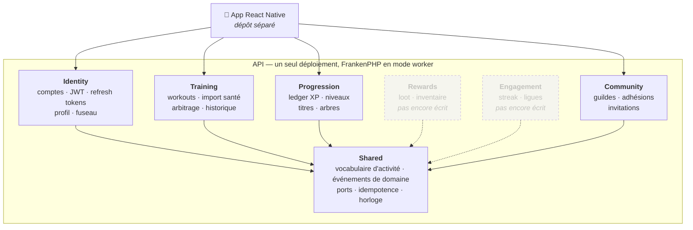

**À retenir.** Il n'y a **aucune flèche entre deux modules métier**. Quand l'un a besoin de
l'autre, il passe par l'un des deux seuls chemins autorisés :

```mermaid
flowchart LR
    subgraph ev["1 · Événement de domaine — asynchrone, sans retour"]
        direction LR
        t["Training"] -->|"WorkoutImported"| out[("outbox")]
        out --> p1["Progression"]
        out -.-> r1["Rewards"]
        out -.-> e1["Engagement"]
    end

    subgraph po["2 · Port dans Shared — synchrone, contrat minuscule"]
        direction LR
        i2["Identity"] -->|"implémente<br/>PlayerTimezones"| s2{{"Shared"}}
        s2 -->|"consommé par"| p2["Progression"]
        p3["Progression"] -->|"implémente<br/>PlayerTitles"| s3{{"Shared"}}
        s3 -->|"consommé par"| i3["Identity"]
    end

    classDef todo stroke-dasharray:4 4,opacity:0.5
    class r1,e1 todo
```

L'événement quand le destinataire peut attendre et n'a rien à répondre. Le port quand la
réponse est nécessaire tout de suite — le fuseau du joueur ne peut pas arriver en différé,
sinon un changement de fuseau suivi d'une séance compterait sur l'ancien.

Un port se justifie **un par un** dans son docblock. Il y en a sept en tout, et c'est
volontaire : `PlayerTimezones`, `PlayerTitles`, `SessionRewards` (par lequel `Training`
crédite l'XP sans connaître `Progression` — appelé **une fois par workout** d'un lot),
`SocialProfileResolver` (aucun test ne peut appeler Google), `ModifierContributor`, et les
deux derniers venus, `PlayerProfiles` et `PlayerProgressions`.

Ces deux-là sont **batch par construction** — leur signature prend une liste d'identifiants,
pas un identifiant — et c'est la seule chose qui les distingue vraiment des autres. La liste
des membres d'une guilde demande N joueurs d'un coup ; un port qui en rendrait un à la fois
deviendrait un N+1 au premier écran, et le problème n'apparaîtrait qu'en production sur les
grosses guildes. En prenant une liste, la signature elle-même interdit d'écrire la boucle.
Un test compte les requêtes d'une guilde de deux membres puis d'une de douze et exige le
même nombre : c'est ce qui empêche la dérive de repasser en revue sans un mot.

Ce dernier est le seul **en éventail** — plusieurs implémentations, un seul consommateur :

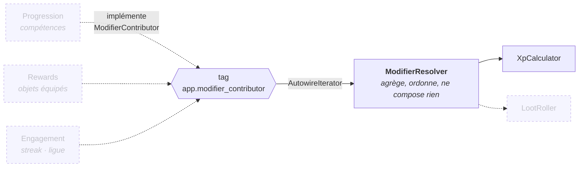

C'est ce qui tient l'invariant **« un seul vocabulaire de modificateurs »** : compétences,
objets, streak et ligue ne produisent pas chacun leur bonus maison, ils produisent tous un
`Modifier` typé. Ouvrir une source, c'est une classe qui implémente le port — rien à câbler,
personne à prévenir, aucune branche de plus dans le calcul d'XP.

Le resolver **n'additionne rien** : filtrer par discipline et par type sont des décisions de
consommateur, et elles diffèrent — `XpCalculator` groupe par source pour son détail animé, le
`LootRoller` ne lira que `LOOT_LUCK`. Il garantit une seule chose en plus de l'agrégation :
l'ordre, tiré de `ModifierSource` et non de l'ordre dans lequel le conteneur a rangé les
services. Un ensemble résolu finit dans un breakdown affiché et dans un tirage audité ; le
faire dépendre d'un ordre de compilation, c'est accepter que deux calculs identiques laissent
deux traces différentes.

**Aucune source ne contribue encore** — le streak arrive au Lot 5, les objets au Lot 6, les
compétences au Lot 7. Le resolver rend donc un ensemble vide, et c'est le branchement qui est
éprouvé en test : un tag mal orthographié ne casse rien, il rend un ensemble vide, et le
joueur serait sous-payé sans que personne le voie.

---

## 2. La vie d'un import

C'est le parcours central du produit. **Le serveur n'a plus l'horloge, il l'arbitre** : les
bornes viennent du fournisseur santé — un workout a eu lieu avant que Grrind en entende parler
— et le serveur décide de ce qu'il en retient.

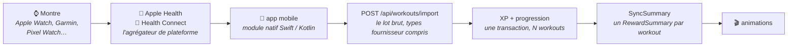

**Grrind ne parle qu'aux agrégateurs.** Garmin, Samsung et Nike Run Club écrivent tous dedans ;
c'est la bonne granularité, et c'est pour ça que `WorkoutSource` n'a que deux valeurs.

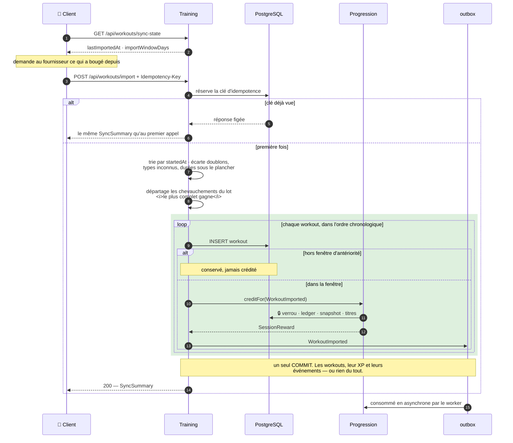

Quatre choses que ce schéma dit et qu'il faut avoir en tête :

- **Un import est un ensemble, pas une transaction tout-ou-rien.** Un workout *écarté* n'annule
  rien — neuf séances valides ne peuvent pas échouer parce que la dixième est une partie de
  curling. Une *panne*, elle, défait tout : un workout écrit sans XP créditée est une perte
  silencieuse.
- **L'ordre chronologique n'est pas cosmétique.** Les rendements décroissants se calculent sur ce
  que le joueur a déjà fait ce jour-là, donc la charge du jour se relit à chaque itération. Le
  même lot envoyé dans un autre ordre doit donner le même ledger.
- **Le verrou est pris une fois** et tenu jusqu'au COMMIT — un verrou de ligne est ré-entrant
  dans une transaction. C'est lui qui sérialise deux appareils du même compte.
- **L'`Idempotency-Key` ne fait pas doublon avec l'unicité `(user, source, externalId)`.**
  Celle-ci empêche le double crédit ; celle-là rend la **réponse** d'origine. Sans elle, un
  client qui rejoue reçoit une synchronisation vide au lieu de sa mise en scène — l'XP serait
  juste, l'animation perdue.

Un workout n'a **pas d'état** : il naît terminé. Ce qui avait un cycle de vie, c'était la séance
chronométrée ; le fait rapporté par une montre est déjà passé quand il arrive. Ce qui reste, ce
sont les cinq façons dont un candidat peut ne pas être crédité :

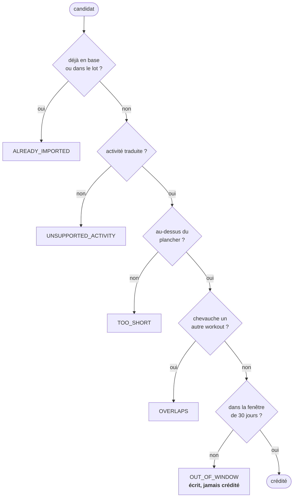

**Seul `OUT_OF_WINDOW` laisse une ligne en base.** Le joueur retrouve son passé sans le
monnayer : le premier import devient un moment de produit — « voilà tes six derniers mois » — au
lieu d'un mur. C'est le garde-fou le plus important du virage, parce qu'un téléphone contient
parfois trois ans d'Apple Health et que le ledger est append-only : crédité tel quel, le joueur
atteint le niveau 60 avant sa première course *pour* Grrind, et ça ne se rattrape pas.

Rien ne réécrit un workout crédité. Une erreur se corrige par une transaction d'XP négative,
jamais par une réécriture d'historique.

---

## 3. Ce qui se passe quand l'XP tombe

Le cœur du produit — le moment dopamine. Tout se joue **dans une seule transaction**, et
l'ordre n'est pas négociable.

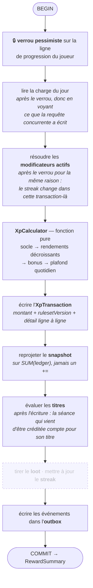

**Ce qui existe aujourd'hui**, c'est tout sauf la case en pointillés, et c'est branché sur
l'import : `ImportWorkoutsHandler` ouvre la transaction, écrit chaque workout, appelle
`GrantXpHandler` par le port `SessionRewards`, et rend le `SyncSummary`. Ce bloc-là est **répété
une fois par workout crédité**, dans l'ordre chronologique — le verrou n'est pris qu'au premier.

**Le port, et pourquoi il en faut un.** Deptrac interdit à `Training` d'importer
`Progression`, et l'événement de domaine — l'autre chemin autorisé — se consomme *après*
le COMMIT, alors que le crédit doit être annulé si la suite échoue et que la réponse doit
le porter. `SessionRewards` vit donc dans `Shared`, `Progression` l'implémente,
`Training` ne connaît que l'interface. Le loot (Lot 6) et le streak (Lot 5) ajouteront
chacun le leur, entre le crédit et l'outbox.

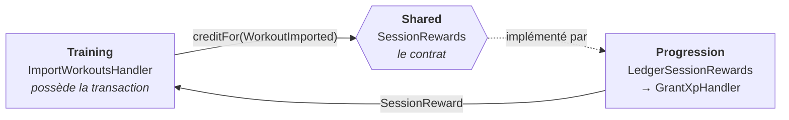

**Le verrou est posé par l'implémentation, à l'intérieur de la transaction de `Training`.**
Le `wrapInTransaction` de `GrantXpHandler` n'en rouvre pas une seconde : DBAL en fait un
point de sauvegarde, le verrou de ligne court jusqu'au COMMIT extérieur.

**Ce qui sort du COMMIT : le `SyncSummary`.** C'est le contrat le plus coûteux à casser du
produit, et **l'ordre de ses clés est l'ordre de l'animation**, maintenant à deux niveaux : entre
les workouts d'abord — `imported` est chronologique — puis à l'intérieur de chacun. Le client le
joue de haut en bas, il ne le réordonne pas.

Chaque élément d'`imported` est **exactement** le `RewardSummary` d'un workout. C'est ce qui rend
une synchronisation de dix séances aussi simple à animer qu'une seule. `totals` résume la
timeline — « +847 XP · niveau 10 → 15 » — et n'en est jamais la source : il est dérivé de la
liste, et vaut `null` quand rien n'a été crédité.

`loot`, `streak` et `unlockableNodes` sont présents et vides jusqu'aux Lots 6, 5 et 7 : une clé
qui apparaîtrait plus tard obligerait un client déjà déployé à la rendre optionnelle pour
toujours.

Le palier de départ y est donné **en entier** — `before`, `xpIntoLevelBefore`,
`xpToNextLevelBefore` — et pas seulement son numéro. Le client place la barre, puis la
remplit : sans la largeur du palier d'où elle part, il ne sait pas où la placer. Elle se
redéduit du reste tant que `after` vaut `before + 1`, et plus du tout dès qu'il y a deux
niveaux à franchir, ce qui est un cas normal (#79).

```jsonc
{
  "syncedAt": "2026-08-13T19:04:00Z",     // l'horloge du serveur, seul instant qui n'en vienne pas du fournisseur
  "imported": [
    {
      "session":  { /* le workout, forme identique partout dans l'API */ },
      "xp":       { "awarded": 145,
                    "breakdown": [ { "source": "BASE",        "amount":  60 },
                                   { "source": "DISTANCE",    "amount": 100 },
                                   { "source": "DIMINISHING", "amount": -15 } ] },
      "level":    { "before": 1, "xpIntoLevelBefore": 0, "xpToNextLevelBefore": 100,
                    "after": 2, "reached": [2],
                    "totalXp": 145, "xpIntoLevel": 45, "xpToNextLevel": 115,
                    "skillPointsGranted": 1 },
      "titlesUnlocked": [ /* PlayerTitle, déjà traduit — rien à recharger */ ],
      "loot": [], "streak": null, "unlockableNodes": [],
      "rulesetVersion": "…"
    }
    // … un par workout crédité, dans l'ordre chronologique
  ],
  "skipped": [ { "externalId": "…", "activityType": "curling", "reason": "UNSUPPORTED_ACTIVITY" } ],
  "totals":  { "levelBefore": 1, "levelAfter": 2, "xpBefore": 0, "xpAfter": 145,
               "xpAwarded": 145, "workoutCount": 1 },   // `null` si rien n'a été crédité
  "rulesetVersion": "…"
}
```

**`skipped` n'est pas du bruit.** Chaque séance écartée est **nommée**, avec son type d'activité
brut : un workout qui disparaît sans un mot est un bug du point de vue du joueur, même quand le
serveur a raison de l'écarter.

Pourquoi cet ordre, en trois phrases :

- **Le verrou d'abord.** Il porte sur *une ligne* — deux joueurs ne s'attendent jamais. Sans
  lui, deux synchronisations simultanées lisent le même total, calculent le même niveau et
  s'écrasent l'une l'autre.
- **La lecture du jour et des modificateurs après le verrou.** Sinon les rendements
  décroissants se contourneraient en créditant deux workouts à la même seconde, et un ensemble
  de bonus lu avant la transaction créditerait un streak déjà périmé. C'est aussi ce qui rend un
  lot correct workout par workout : la charge est relue à chaque itération, donc le deuxième
  workout d'une journée voit le premier même s'ils arrivent ensemble.
- **La journée est celle du sport, pas celle de l'import.** L'écriture au ledger porte
  `occurred_at` ; dix workouts importés d'un coup appartiennent à dix journées différentes, et
  les dater de leur insertion les entasserait tous sous le plafond quotidien du jour de la
  synchronisation.
- **Le snapshot relit le ledger, il ne s'incrémente pas.** Un `+=` transformerait chaque
  divergence en dette permanente ; là, un écart se résorbe tout seul au crédit suivant.

Et le calcul lui-même, qui est une **fonction pure et versionnée** :

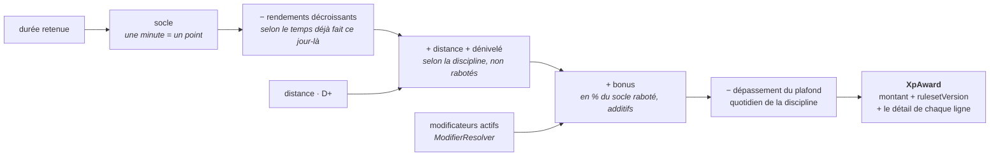

**La formule tient en une phrase** : une minute vaut un point, plus les kilomètres, plus le
dénivelé. Le taux horaire par discipline a disparu — c'était une calibration inventée avant
d'avoir un seul joueur, et six lignes à défendre à chaque discussion d'équilibrage. Ce qui
distingue les disciplines est désormais **mesuré**, ou assumé comme absent : `STRENGTH`, `HIIT`,
`MOBILITY` et `CLIMBING` sont à la durée seule parce qu'aucune montre ne leur donne une seconde
dimension fiable, et une dimension qu'on n'aurait que sur la moitié des appareils créerait deux
jeux au lieu d'un.

**Le terrain échappe aux rendements décroissants** : dix kilomètres restent dix kilomètres quelle
que soit l'heure à laquelle on les a courus. Ce sont les *minutes* qui décroissent. C'est le
plafond quotidien qui borne ce côté-là.

**Les bonus sont additifs sur le socle raboté**, terrain non compris, et pas multiplicatifs :
`90 + 18 + 13 = 121`, et non `90 × 1,20 × 1,15`. Chaque ligne du détail reste ainsi vraie
isolément — « +18 grâce à ta série » ne dépend pas de ce qui a été appliqué avant, et un même
streak ne vaut pas trois fois plus sur un trail que sur une séance de fonte. Et chaque garde-fou
a **sa ligne dans le détail** : montrer ce qui a été rogné est ce qui sépare une mécanique d'une
punition.

---

## 4. Le modèle de données

```mermaid
erDiagram
    identity_user ||--o{ identity_refresh_token : "une famille par appareil"
    identity_user ||--o{ identity_social_identity : "Google · Apple"
    xp_transaction ||--|{ xp_transaction_line : "le détail du calcul"
    player_title ||--o| player_active_title : "clé étrangère composée"

    identity_user {
        uuid id PK "UUID v7"
        string email UK "normalisée en minuscules"
        string password "null si compte social"
        json roles
        string timezone "le streak se calcule dedans"
    }
    identity_refresh_token {
        uuid id PK
        uuid family_id "une famille = un appareil"
        string token_hash UK "SHA-256 seul, jamais le jeton"
        timestamptz consumed_at "le rejeu révoque la famille"
    }
    workout {
        uuid id PK
        uuid user_id "pas de FK — autre module"
        timestamptz started_at "l'horloge du fournisseur"
        timestamptz ended_at "les deux bornes, jamais nulles"
        int duration_seconds "calculée des bornes, jamais recopiée"
        enum source "APPLE_HEALTH | HEALTH_CONNECT"
        enum trust "DECLARED puis PROVIDER_VERIFIED"
        string external_id "UK partiel avec (user, source)"
        int distance_meters "null = non mesuré, jamais zéro"
        int elevation_gain_meters "idem — aucun appareil ne fournit tout"
    }
    xp_transaction {
        uuid id PK
        uuid user_id
        uuid source_id "le workout — UK avec reason"
        int amount "signé, somme de ses lignes"
        enum reason "COMPLETED | INVALIDATED"
        int duration_seconds "signée elle aussi"
        timestamptz occurred_at "le jour du SPORT, pas de l'écriture"
        string ruleset_version "les règles du jour du calcul"
    }
    progression_snapshot {
        uuid user_id PK "la ligne qu'on verrouille"
        int total_xp
        int level "projeté, jamais saisi"
        int earned_skill_points
    }
    player_title {
        uuid user_id PK
        string title_id PK "pas de FK — catalogue en YAML"
        timestamptz unlocked_at "définitif"
    }
    shared_idempotency_key {
        uuid user_id "l'unicité est (user, clé)"
        string key
        json response "figée et rejouée"
    }
```

Quatre lectures de ce schéma :

- **Aucune clé étrangère ne traverse une frontière de module.** `workout.user_id` et
  `xp_transaction.user_id` ne référencent rien : la frontière vaut pour les tables autant que
  pour les classes.
- **`uniq_workout_external` est ce qui empêche le double crédit**, et c'est la base qui le tient,
  pas le code : entre le `SELECT` qui cherche l'identifiant et l'`INSERT` qui l'écrit, deux
  synchronisations concurrentes passent toutes les deux. Il est **partiel** — `WHERE external_id
  IS NOT NULL` — parce que PostgreSQL considère deux `NULL` comme distincts et qu'une contrainte
  totale n'interdirait rien.
- **`xp_transaction` est la vérité, `progression_snapshot` est un cache.** Le niveau est une
  projection ; le snapshot se reconstruit intégralement du ledger, et `app:progression:rebuild`
  le prouve — `--dry-run` compare toute la base sans rien écrire, une passe normale réécrit ce
  qui a dérivé, par le chemin exact du crédit d'un workout.
- **Le ledger est append-only.** Aucun mutateur sur les entités, et un listener Doctrine refuse
  `UPDATE` et `DELETE`. Un workout invalidé écrit une transaction **négative** ; on ne supprime
  rien. L'annulation reprend l'`occurred_at` du crédit, pour se solder sur la journée qu'elle
  annule et pas sur celle où on s'en aperçoit.
- **`player_title` ne se vide jamais.** Un titre débloqué ne se reprend pas, même si une séance
  annulée fait repasser le compteur sous le seuil : l'XP est une monnaie, un titre est un
  souvenir.

Le catalogue de titres, la courbe de niveaux, le barème d'XP et les tables de loot **ne sont pas
en base** — voir la section 6.

---

## 5. L'authentification

Le client détient deux jetons de nature différente : un JWT court qui ne se révoque pas, et un
refresh token long, à usage unique, rotatif.

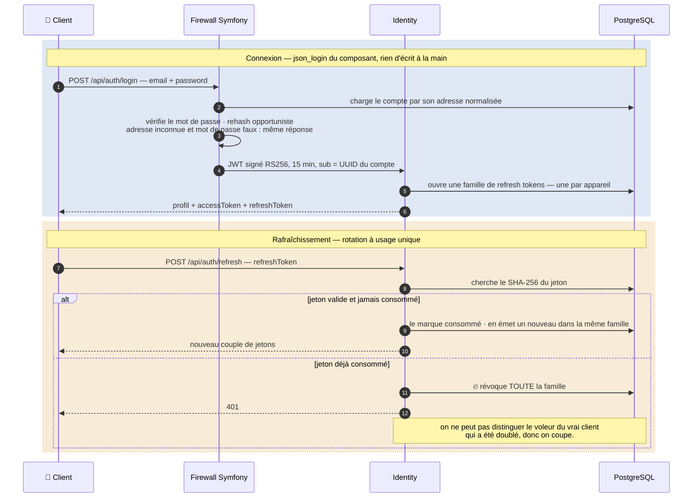

Ce qui compte, et qui n'est pas visible dans le code parce que c'est le framework qui le fait :

- **L'identifiant de sécurité est l'UUID, pas l'adresse.** Changer d'e-mail n'invalide aucun
  jeton, et l'adresse ne voyage pas dans le claim `sub`.
- **Aucune route ne prend d'identifiant de compte pour servir les données du joueur courant.**
  Le `User` vient du jeton, via `#[CurrentUser]` : `/api/me`, `/api/progression` et
  `/api/workouts` ne peuvent pas être détournés pour lire ce qui appartient à un autre.

  La formulation d'origine s'arrêtait à « aucune route ne prend d'identifiant de compte », et
  elle a été **réécrite** au ticket 119 — pas contournée. Voir le profil d'un co-équipier, c'est
  lire les données d'un autre compte. `GET /api/players/{id}` en prend donc un, et l'autorisation
  est portée par un voter (`PLAYER_VIEW` : soi-même, ou un membre de la même guilde) plutôt que
  par la bonne volonté du contrôleur. Le refus est **404 et jamais 403** : un 403 confirmerait
  qu'un compte porte cet UUID, et les UUID v7 encodent leur instant de création — l'API
  deviendrait un moyen d'énumérer les comptes ouverts un jour donné. La réponse ne contient
  ni adresse, ni fuseau, ni rôle : ce sont des données de compte, pas de profil public.
- **Le social sign-in relie par le couple (fournisseur, `sub`), jamais par l'adresse.**
  Rattacher un compte préexistant exige que le fournisseur **certifie** l'adresse — sinon il
  suffirait de créer chez Google un compte portant l'adresse de la victime.

---

## 6. La balance du jeu est du code, pas de la donnée

Courbe de niveaux, barème d'XP, garde-fous, catalogue de titres : tout vit en YAML versionné
sous `config/game/v1/`, **lu une seule fois, à la compilation du conteneur**.

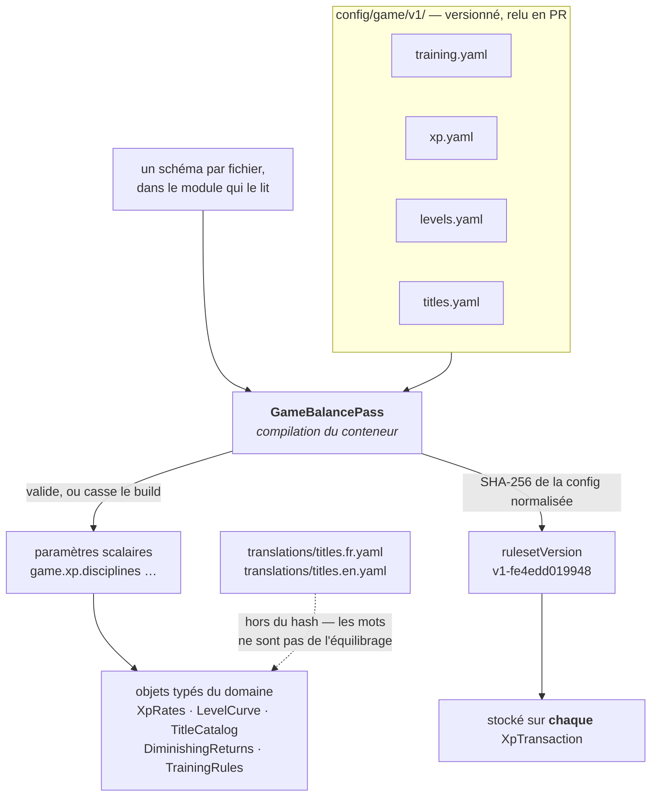

**Trois conséquences voulues :**

- **Un YAML incohérent casse le build**, pas la première requête d'un joueur. En mode worker
  FrankenPHP, aucune requête ne rouvre jamais un fichier.
- **Un fichier posé là sans schéma casse aussi le build.** Sinon ce serait du réglage que
  personne ne lit et que rien ne valide : le silence complet.
- **Le `rulesetVersion` est stocké avec chaque montant d'XP.** On peut donc rééquilibrer sans
  corrompre l'historique : une transaction dit sous quelles règles elle a été accordée. Une
  annulation reprend la version du crédit qu'elle annule — recalculer aux règles courantes ferait
  de chaque rééquilibrage une redistribution silencieuse.

Le hash porte sur la configuration **normalisée**, défauts appliqués : reformater un YAML ne
date pas un rééquilibrage, mais un défaut de schéma qui bouge, si.

---

## 7. Surface d'API

Toute erreur sort en `application/problem+json`, avec un `type` stable sous
`https://grrind.app/problems/` — c'est là-dessus que le client branche ses messages, jamais sur
le `detail`.

| Route | Auth | Réponse |
|---|---|---|
| `GET /health` | — | état de la base |
| `POST /api/auth/register` | — | 201, compte + jetons |
| `POST /api/auth/login` | — | 200, compte + jetons |
| `POST /api/auth/refresh` | refresh token | 200, compte + jetons tournés |
| `POST /api/auth/logout` | refresh token | 204 |
| `POST /api/auth/social/{google\|apple}` | code d'autorisation | 200, compte + jetons |
| `GET · PATCH /api/me` | Bearer | profil, titre porté, prochain titre |
| `POST /api/workouts/import` | Bearer + `Idempotency-Key` | 200, `SyncSummary` |
| `GET /api/workouts` | Bearer | 200, page d'historique + `nextCursor` |
| `GET /api/workouts/sync-state` | Bearer | 200, `lastImportedAt` + `importWindowDays` |
| `GET /api/titles` | Bearer | 200, catalogue situé + titre porté |
| `PUT /api/titles/active` | Bearer | 200, catalogue après changement |
| `GET /api/progression` | Bearer | 200, état du joueur — servi du snapshot |
| `GET /api/progression/history` | Bearer | 200, page de ledger + `nextCursor` |

**Trois routes lisent les titres, et c'est délibéré.** `/api/me` en montre deux — le porté et
le prochain — parce que le client les affiche à côté du pseudo. `/api/titles` montre le
catalogue **entier**, situé sur un relevé du ledger, parce qu'un écran de sélection doit donner
à viser. `/api/progression` ne montre que **l'acquis**, et c'est ce qui lui permet de tenir sur
le seul snapshot : lister ce qu'on a débloqué ne demande aucune agrégation, situer ce qu'on n'a
pas encore en demande une.

**Une forme par concept, partout.** `register`, `login`, `refresh` et `social` rendent le même
`AuthResource`. Un workout a la même forme dans l'historique et dans un `SyncSummary`. Un titre a
la même forme dans le profil et dans le catalogue. Le client décode un seul type par concept — un
champ qui apparaît et disparaît selon la route finit lu de travers.

**Une seule pagination.** Les deux historiques — workouts et ledger — partagent le même curseur
composite et opaque, `(date, identifiant)`. Il a été un simple UUID v7 tant que l'identifiant
naissait à l'instant du fait ; l'import a séparé les deux, et l'ordre rendu devenait celui de la
synchronisation plutôt que celui de la pratique. La date seule ne suffirait pas non plus : deux
séances peuvent commencer à la même seconde.

---

## 8. Ce qui tourne en asynchrone

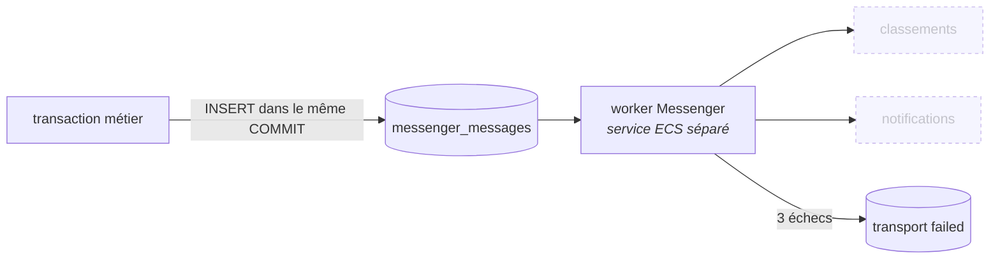

Le transport Doctrine n'est pas un pis-aller en attendant « un vrai broker » : c'est ce qui rend
la publication **atomique**. Publier après le `COMMIT` perd l'événement si le processus meurt
entre les deux ; publier avant annonce un fait encore annulable.

---

## 9. Les décisions qu'on « corrigerait » dans le mauvais sens

Une ligne chacune, parce qu'elles sont contre-intuitives et que le réflexe naturel est de les
défaire. Le raisonnement complet est dans le docblock du fichier concerné.

- **Pas de bus de commandes.** Les contrôleurs appellent les handlers directement. Messenger
  sert l'asynchrone, pas à ajouter une indirection synchrone.
- **Les objets commande restent** malgré l'absence de bus : ils donnent un domicile aux
  invariants (« le *quand* n'est pas un paramètre ») et rendent les handlers testables sans HTTP.
- **Une lecture sans règle n'a pas de handler.** Le contrôleur appelle le dépôt. Une classe qui
  relaie un `findOneBy` est l'indirection que la règle n°0 interdit.
- **L'append-only est tenu par l'applicatif, pas par un trigger.** Un `DELETE` en SQL direct
  passerait au travers — c'est le prix, il est assumé.
- **Les refresh tokens sont faits main** alors qu'un bundle de référence existe : il stocke le
  jeton en clair, ignore la notion de famille et ne détecte pas le rejeu.
- **Le snapshot stocke les points de compétence *accordés*, pas *disponibles*.** Un solde
  rendrait le cache irreconstructible, puisque le ledger ignore les dépenses. L'API sert
  quand même les **deux** nombres, égaux jusqu'au Lot 7 : les fondre obligerait à renommer,
  donc à casser le client, le jour où le premier point se dépense.
- **`GET /api/progression` sert les colonnes du snapshot telles quelles**, sans les reprojeter
  de son total. Reprojeter masquerait précisément la divergence que la reconstruction (#20)
  existe pour détecter, et ferait de chaque ouverture d'app une réparation silencieuse.
- **Pas d'app Watch Grrind en V1.** Apple Exercice fait déjà le travail pour les sept sports
  visés, et une app de plus au poignet n'ajouterait qu'un endroit où oublier de lancer le
  chronomètre. Elle redeviendra pertinente le jour où une activité demandera une interaction
  *propre à Grrind* — l'escalade voie par voie, typiquement — pas avant.
- **Pas de saisie manuelle.** L'échappatoire déclarative brouillerait la seule question que cette
  V1 pose : *est-ce que voir mon activité réelle alimenter mon personnage est fun ?* Une réponse
  obtenue sur des séances saisies à la main ne dirait rien de celle-là. Le modèle est prêt à
  l'accueillir — `TrustLevel::Declared` existe pour ça — c'est le produit qui n'en veut pas
  encore.
- **Un workout hors fenêtre est conservé sans être crédité**, et non ignoré. Le joueur retrouve
  son passé sans le monnayer, le streak (Lot 5) aura de quoi se reconstruire, et le premier
  import devient un moment de produit au lieu d'un mur.
- **Aucune ligne de ledger pour un workout archivé.** L'idée d'une écriture à zéro paraît plus
  cohérente avec l'append-only ; elle est en fait un piège : `recordOf()` compte les séances par
  `SUM(CASE WHEN reason = COMPLETED THEN 1 ELSE -1 END)`, donc une troisième raison *retirerait*
  une séance au relevé qui débloque les titres. L'append-only protège les crédits contre la
  réécriture, il n'oblige pas à enregistrer les non-événements.
- **Sur un chevauchement, c'est l'enregistrement le plus complet qui gagne**, pas le premier
  arrivé — mais **jamais** contre une ligne déjà en base. Deux applications ne démarrent jamais à
  la même seconde, donc « le premier » revient à tirer au sort ; détrôner une ligne déjà créditée
  demanderait de la supprimer et de contrepasser son écriture.
- **`lastImportedAt` compte les archives.** Ce que le client cherche est la frontière de ce que
  le serveur *connaît*, pas de ce qu'il a payé : la borner aux séances créditées ferait
  re-télécharger et ré-envoyer tout l'archivé à chaque synchronisation.
- **Le ledger est daté par le sport, pas par son écriture.** L'instant de l'insertion n'est pas
  perdu pour autant : l'identifiant est un UUID v7, il l'encode — et c'est une des raisons de ce
  choix.
- **`totals` du `SyncSummary` vaut `null` quand rien n'a été crédité**, plutôt que des zéros. Il
  n'y a pas d'état d'arrivée quand rien n'est arrivé, et « niveau 0 → 0 » mentirait à un joueur
  de niveau 12.
- **Pas de Redis en v1**, et le déclencheur est écrit : le jour où il y a plus d'un conteneur
  applicatif **et** un besoin d'état partagé. Le verrou de complétion est pessimiste sur une
  ligne ; un verrou distribué serait un affaiblissement.
- **Pas de valeur « autre » dans `Discipline`**, ni de « correction manuelle » dans `XpReason`.
  Une valeur qu'aucun code n'écrit est une porte qu'on finit par pousser.
- **Le `ModifierResolver` agrège, il ne compose pas.** Additionner ou filtrer chez lui
  obligerait ses deux consommateurs, qui ne veulent ni le même type ni la même portée, à
  défaire son travail.
- **`app:progression:rebuild --dry-run` sort en erreur quand il trouve un écart.** La commande
  est faite pour tourner en tâche planifiée, et une sonde qui rend toujours zéro ne sonde rien.
  Hors `--dry-run`, réparer *est* le travail : la sortie est zéro même après réécriture.
- **La reconstruction compare avant d'écrire, y compris hors `--dry-run`.** Réécrire tout le
  monde « pour être sûr » remonterait `updated_at` sur des comptes qui n'ont rien fait — or
  cette colonne sort en `lastProgressionAt`. Une commande de maintenance qui fait mentir
  l'écran d'un joueur est pire que le problème qu'elle répare.
- **Un compte sans ligne de progression n'est pas un écart** tant que son ledger est vide :
  c'est l'état normal d'une inscription, et c'est le premier crédit qui pose la ligne.
- **`openapi.yaml` décrit un schéma qu'aucune route ne référence** : `PushNotificationData`, le
  `data` d'un push. Le canal est APNs, pas HTTP, mais le contrat est le même — le client route
  sur `routeType` et doit le générer, pas le recopier. Il est déclaré sous `models.names` et
  décrit depuis la classe que le sender utilise ; lui inventer une route pour « le raccrocher »
  serait une route de plus à documenter et à sécuriser, et le supprimer parce qu'il est orphelin
  rendrait le client à sa chaîne recopiée.

---

## 10. Ce qui mord

Les pièges qui se reproduisent. Les autres sont datés, corrigés, et vivent dans `git log`.

- **`make migrate` avant `make migration`.** Le diff compare au schéma de la base de dev, pas
  aux migrations écrites : une base en retard fait reproduire ses instructions dans la suivante.
  Relire chaque diff en cherchant ce qui ne parle pas du ticket en cours.
- **Le diff Doctrine ne sait pas renommer une colonne.** Il propose `DROP` + `ADD`, et des
  `NOT NULL` sans défaut qui échouent sur une table peuplée.
- **Après tout `composer require`, lire `git status`.** Les recettes Flex écrasent des fichiers
  de config existants — `deptrac.yaml` et `compose.yaml` y sont déjà passés.
- **Un index partiel se déclare tel que PostgreSQL le *relit***, parenthèses et casts compris,
  sinon chaque diff reproposera le même `DROP` + `CREATE`. Doctrine compare des chaînes :
  `external_id IS NOT NULL` et `(external_id IS NOT NULL)` sont deux prédicats différents pour
  lui. Ça s'est reproduit sur `uniq_workout_active` puis sur `uniq_workout_external`, et ça se
  reproduira sur le prochain — le diagnostic tient en une requête :
  `SELECT indexname, indexdef FROM pg_indexes WHERE tablename = '…'`.
- **Le Serializer ne descend pas dans une liste d'objets sans qu'on le lui dise.**
  `with_constructor_extractor: true` — posé par la recette Flex — met `ConstructorExtractor` en
  tête, et il ne consulte que `ReflectionExtractor`, qui lit la signature : un `array` reste un
  `array` sans type d'élément. `#[MapRequestPayload]` rend alors des tableaux bruts, et le
  contrôleur casse à l'exécution. La correction est dans `config/packages/property_info.yaml`, et
  elle vaut pour **tout** DTO portant une liste.
- **Doctrine hydrate une projection de champ à travers son type.** `->select('u.timezone')` rend
  un `Timezone`, pas une chaîne. Se méfier de tout repli silencieux sur une valeur plausible.
- **Symfony ne charge pas `.env.local` en environnement `test`** — d'où le `.env.test.local` que
  `make secrets` écrit aussi. Un secret oublié là produit vingt échecs qui ressemblent à tout
  sauf à un problème de configuration.
- **Lexik dispatche ses événements sous un nom, pas sous leur classe.** Un
  `#[AsEventListener(event: JWTNotFoundEvent::class)]` ne se déclenche jamais, sans erreur.
- **Vérifier le corps d'une erreur, pas seulement son code.** Un membre d'extension nommé comme
  un membre standard de problem+json disparaît silencieusement de la réponse.
- **Un N+1 Doctrine ne se voit dans aucune assertion.** Une collection chargée en boucle rend
  la même réponse qu'une collection préchargée ; seul le nombre de requêtes change, et il croît
  avec la taille de la page. Ça se teste en comptant les requêtes
  (`doctrine.debug_data_holder`), pas en relisant le JSON.
- **`SymfonyStyle::table()` est intestable avec `runCommand()`.** L'API récente écrit dans un
  `TestOutput` qui refuse `section()`, dont `createTable()` se sert — et ça sort en
  `LogicException`, pas en assertion ratée. Le testeur historique (`CommandTester::execute()`)
  écrit dans un `StreamOutput` simple et n'a pas ce trou. C'est le harnais qu'on change, pas la
  sortie de la commande.
- **Un service tagué qui n'est pas ramassé ne lève rien.** Tag mal orthographié,
  autoconfiguration coupée, service retiré parce qu'inutilisé : l'itérateur est simplement
  vide. Un contributeur de modificateurs qui se tait sous-paie un joueur en silence, et
  l'écriture est au ledger — donc chaque port en éventail se prouve contre le vrai conteneur.
