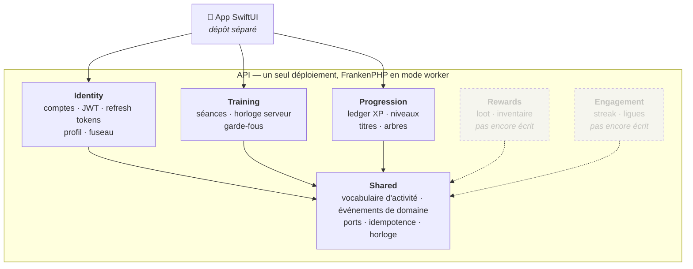
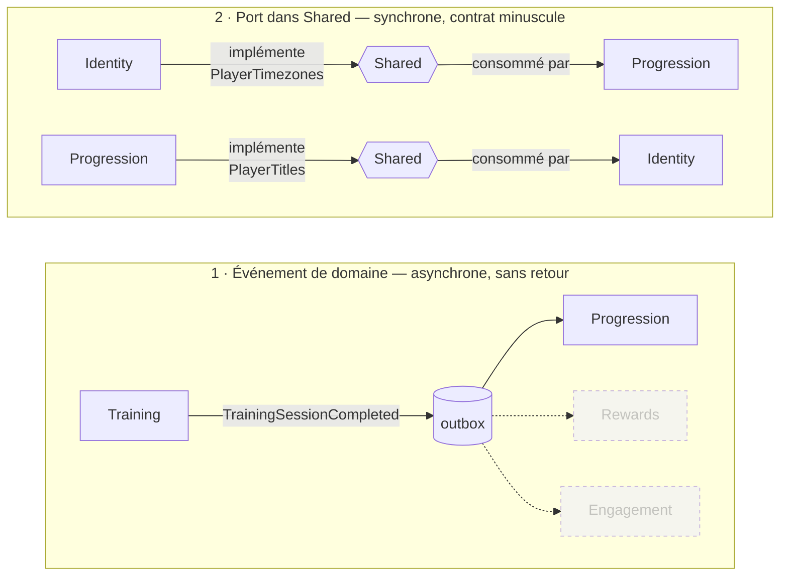
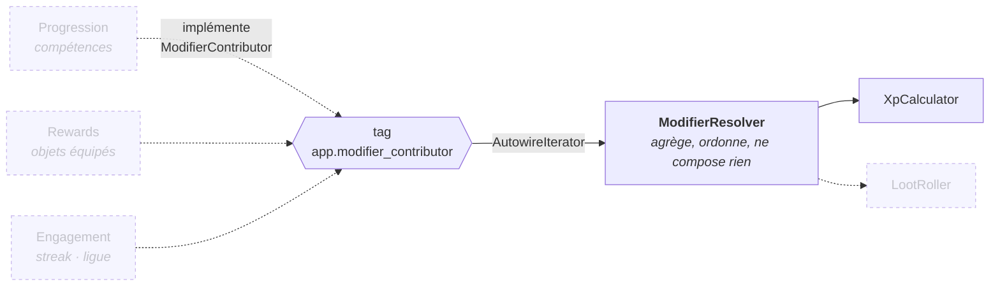
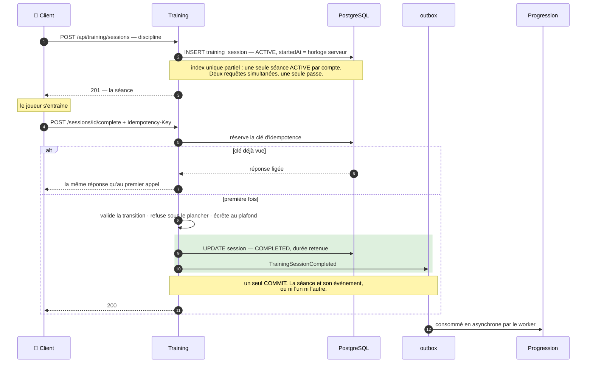
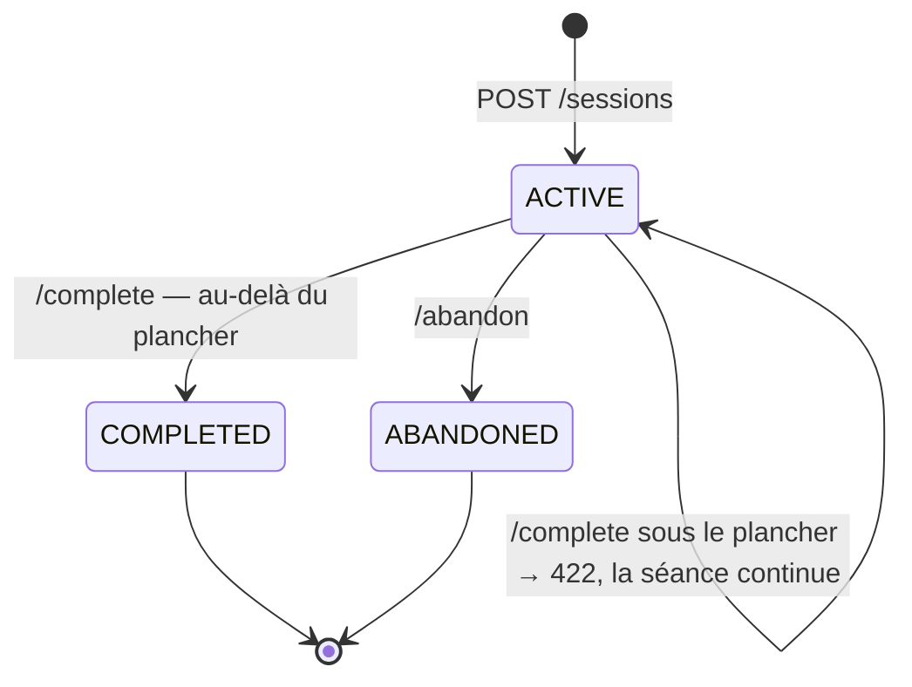
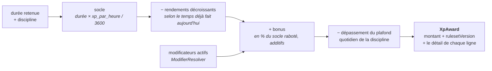
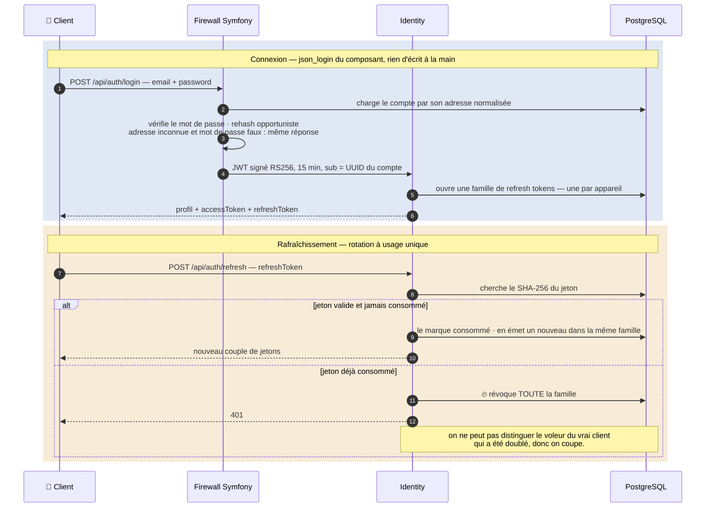
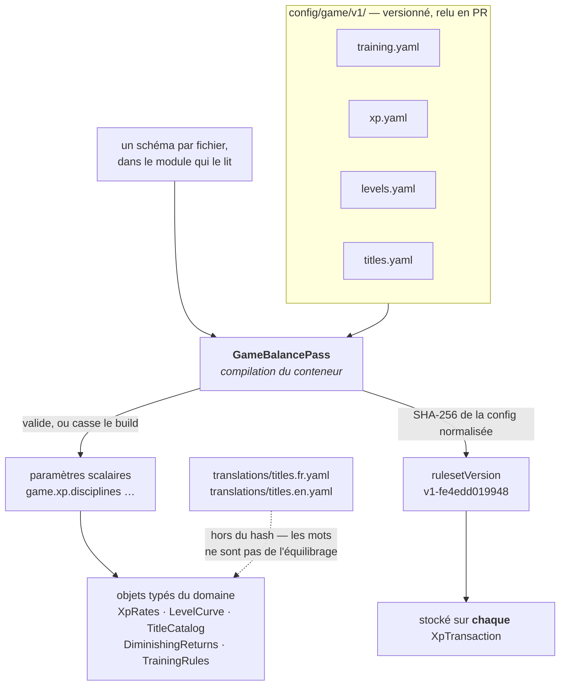
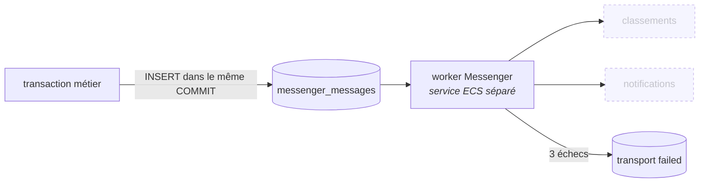

# Le back de GRRIND, en schémas

Ce fichier existe pour être **regardé**, pas lu en entier. Il répond à une seule question :
« qu'est-ce qui se passe dans ce back, et dans quel ordre ? »

Ce qu'il ne porte pas, et où ça vit :

| Ce que vous cherchez | Où c'est |
|---|---|
| Ce qui reste à faire | le [tableau GitHub](https://github.com/users/younesdiouri/projects/1) |
| Le périmètre exact d'une feature | son ticket |
| Pourquoi tel arbitrage a été tranché | la PR qui l'a introduit, et le docblock du fichier concerné |
| Les règles de travail et les invariants | [CLAUDE.md](CLAUDE.md) |

Les schémas sont en Mermaid : GitHub les rend nativement dans cette page.

---

## 1. La carte

Un seul déploiement, six modules à frontières dures. **Un module ne connaît que `Shared`** —
Deptrac le vérifie en CI, et le build casse sur une flèche interdite.

**À retenir.** Il n'y a **aucune flèche entre deux modules métier**. Quand l'un a besoin de
l'autre, il passe par l'un des deux seuls chemins autorisés :

L'événement quand le destinataire peut attendre et n'a rien à répondre. Le port quand la
réponse est nécessaire tout de suite — le fuseau du joueur ne peut pas arriver en différé,
sinon un changement de fuseau suivi d'une séance compterait sur l'ancien.

Un port se justifie **un par un** dans son docblock. Il y en a quatre en tout, et c'est
volontaire : `PlayerTimezones`, `PlayerTitles`, `SocialProfileResolver` (aucun test ne peut
appeler Google), et `ModifierContributor`.

Ce dernier est le seul **en éventail** — plusieurs implémentations, un seul consommateur :

C'est ce qui tient l'invariant **« un seul vocabulaire de modificateurs »** : compétences,
objets, streak et ligue ne produisent pas chacun leur bonus maison, ils produisent tous un
`Modifier` typé. Ouvrir une source, c'est une classe qui implémente le port — rien à câbler,
personne à prévenir, aucune branche de plus dans le calcul d'XP.

Le resolver **n'additionne rien** : filtrer par discipline et par type sont des décisions de
consommateur, et elles diffèrent — `XpCalculator` groupe par source pour son détail animé, le
`LootRoller` ne lira que `LOOT_LUCK`. Il garantit une seule chose en plus de l'agrégation :
l'ordre, tiré de `ModifierSource` et non de l'ordre dans lequel le conteneur a rangé les
services. Un ensemble résolu finit dans un breakdown affiché et dans un tirage audité ; le
faire dépendre d'un ordre de compilation, c'est accepter que deux calculs identiques laissent
deux traces différentes.

**Aucune source ne contribue encore** — le streak arrive au Lot 5, les objets au Lot 6, les
compétences au Lot 7. Le resolver rend donc un ensemble vide, et c'est le branchement qui est
éprouvé en test : un tag mal orthographié ne casse rien, il rend un ensemble vide, et le
joueur serait sous-payé sans que personne le voie.

---

## 2. La vie d'une séance

C'est le parcours central du produit. **Le serveur possède l'horloge** : le client n'envoie
jamais de date, il annonce seulement une intention.

Trois choses que ce schéma dit et qu'il faut avoir en tête :

- **La durée retenue n'est pas `endedAt - startedAt`.** Le plafond écrête : un chronomètre
  oublié rend quatre heures créditées au lieu de tout perdre. C'est la durée retenue qui fait foi.
- **L'`Idempotency-Key` est obligatoire** sur les écritures métier. Les clients mobiles rejouent
  leurs requêtes ; sans elle, une requête perdue en route puis renvoyée afficherait un échec
  pour une action réussie.
- **Un abandon ne produit pas d'événement.** Il n'y a rien à apprendre à quiconque d'une
  séance qui ne compte pas.

Les états d'une séance sont sans retour :

Rien ne ramène une séance dans la course. Une erreur se corrige par une transaction d'XP
négative, jamais par une réécriture d'historique.

---

## 3. Ce qui se passe quand l'XP tombe

Le cœur du produit — le moment dopamine. Tout se joue **dans une seule transaction**, et
l'ordre n'est pas négociable.

**Ce qui existe aujourd'hui**, c'est tout sauf la case en pointillés — et le tout n'est pas
encore branché sur la complétion de séance : `GrantXpHandler` porte déjà la séquence,
[le ticket 21](https://github.com/younesdiouri/grrind-back/issues/21) l'appellera depuis
`CompleteSessionHandler` et
[le 22](https://github.com/younesdiouri/grrind-back/issues/22) en fera le `RewardSummary`.

Pourquoi cet ordre, en trois phrases :

- **Le verrou d'abord.** Il porte sur *une ligne* — deux joueurs ne s'attendent jamais. Sans
  lui, deux complétions simultanées lisent le même total, calculent le même niveau et
  s'écrasent l'une l'autre.
- **La lecture du jour et des modificateurs après le verrou.** Sinon les rendements
  décroissants se contourneraient en clôturant deux séances à la même seconde, et un ensemble
  de bonus lu avant la transaction créditerait un streak déjà périmé.
- **Le snapshot relit le ledger, il ne s'incrémente pas.** Un `+=` transformerait chaque
  divergence en dette permanente ; là, un écart se résorbe tout seul au crédit suivant.

Et le calcul lui-même, qui est une **fonction pure et versionnée** :

**Les bonus sont additifs sur le socle**, pas multiplicatifs : `90 + 18 + 13 = 121`, et non
`90 × 1,20 × 1,15`. Chaque ligne du détail reste ainsi vraie isolément — « +18 grâce à ta
série » ne dépend pas de ce qui a été appliqué avant. Et chaque garde-fou a **sa ligne dans le
détail** : montrer ce qui a été rogné est ce qui sépare une mécanique d'une punition.

---

## 4. Le modèle de données

```mermaid
erDiagram
    identity_user ||--o{ identity_refresh_token : "une famille par appareil"
    identity_user ||--o{ identity_social_identity : "Google · Apple"
    xp_transaction ||--|{ xp_transaction_line : "le détail du calcul"
    player_title ||--o| player_active_title : "clé étrangère composée"

    identity_user {
        uuid id PK "UUID v7"
        string email UK "normalisée en minuscules"
        string password "null si compte social"
        json roles
        string timezone "le streak se calcule dedans"
    }
    identity_refresh_token {
        uuid id PK
        uuid family_id "une famille = un appareil"
        string token_hash UK "SHA-256 seul, jamais le jeton"
        timestamptz consumed_at "le rejeu révoque la famille"
    }
    training_session {
        uuid id PK
        uuid user_id "pas de FK — autre module"
        enum status "index unique partiel sur ACTIVE"
        timestamptz started_at "horloge serveur"
        int duration_seconds "la durée RETENUE, écrêtée"
        enum source "MANUAL_TIMER puis STRAVA"
        enum trust "DECLARED puis PROVIDER_VERIFIED"
    }
    xp_transaction {
        uuid id PK
        uuid user_id
        uuid source_id "la séance — UK avec reason"
        int amount "signé, somme de ses lignes"
        enum reason "COMPLETED | INVALIDATED"
        int duration_seconds "signée elle aussi"
        string ruleset_version "les règles du jour du calcul"
    }
    progression_snapshot {
        uuid user_id PK "la ligne qu'on verrouille"
        int total_xp
        int level "projeté, jamais saisi"
        int earned_skill_points
    }
    player_title {
        uuid user_id PK
        string title_id PK "pas de FK — catalogue en YAML"
        timestamptz unlocked_at "définitif"
    }
    shared_idempotency_key {
        uuid user_id "l'unicité est (user, clé)"
        string key
        json response "figée et rejouée"
    }
```

Quatre lectures de ce schéma :

- **Aucune clé étrangère ne traverse une frontière de module.** `training_session.user_id` et
  `xp_transaction.user_id` ne référencent rien : la frontière vaut pour les tables autant que
  pour les classes.
- **`xp_transaction` est la vérité, `progression_snapshot` est un cache.** Le niveau est une
  projection ; le snapshot se reconstruit intégralement du ledger, et
  [le ticket 20](https://github.com/younesdiouri/grrind-back/issues/20) le prouvera en le
  réécrivant à l'identique.
- **Le ledger est append-only.** Aucun mutateur sur les entités, et un listener Doctrine refuse
  `UPDATE` et `DELETE`. Une séance invalidée écrit une transaction **négative** ; on ne supprime
  rien.
- **`player_title` ne se vide jamais.** Un titre débloqué ne se reprend pas, même si une séance
  annulée fait repasser le compteur sous le seuil : l'XP est une monnaie, un titre est un
  souvenir.

Le catalogue de titres, la courbe de niveaux, le barème d'XP et les tables de loot **ne sont pas
en base** — voir la section 6.

---

## 5. L'authentification

Le client détient deux jetons de nature différente : un JWT court qui ne se révoque pas, et un
refresh token long, à usage unique, rotatif.

Ce qui compte, et qui n'est pas visible dans le code parce que c'est le framework qui le fait :

- **L'identifiant de sécurité est l'UUID, pas l'adresse.** Changer d'e-mail n'invalide aucun
  jeton, et l'adresse ne voyage pas dans le claim `sub`.
- **Aucune route ne prend d'identifiant de compte en paramètre.** Le `User` vient du jeton, via
  `#[CurrentUser]`. Une route ne peut donc pas être détournée pour lire le profil d'un autre.
- **Le social sign-in relie par le couple (fournisseur, `sub`), jamais par l'adresse.**
  Rattacher un compte préexistant exige que le fournisseur **certifie** l'adresse — sinon il
  suffirait de créer chez Google un compte portant l'adresse de la victime.

---

## 6. La balance du jeu est du code, pas de la donnée

Courbe de niveaux, barème d'XP, garde-fous, catalogue de titres : tout vit en YAML versionné
sous `config/game/v1/`, **lu une seule fois, à la compilation du conteneur**.

**Trois conséquences voulues :**

- **Un YAML incohérent casse le build**, pas la première requête d'un joueur. En mode worker
  FrankenPHP, aucune requête ne rouvre jamais un fichier.
- **Un fichier posé là sans schéma casse aussi le build.** Sinon ce serait du réglage que
  personne ne lit et que rien ne valide : le silence complet.
- **Le `rulesetVersion` est stocké avec chaque montant d'XP.** On peut donc rééquilibrer sans
  corrompre l'historique : une transaction dit sous quelles règles elle a été accordée. Une
  annulation reprend la version du crédit qu'elle annule — recalculer aux règles courantes ferait
  de chaque rééquilibrage une redistribution silencieuse.

Le hash porte sur la configuration **normalisée**, défauts appliqués : reformater un YAML ne
date pas un rééquilibrage, mais un défaut de schéma qui bouge, si.

---

## 7. Surface d'API

Toute erreur sort en `application/problem+json`, avec un `type` stable sous
`https://grrind.app/problems/` — c'est là-dessus que le client branche ses messages, jamais sur
le `detail`.

| Route | Auth | Réponse |
|---|---|---|
| `GET /health` | — | état de la base |
| `POST /api/auth/register` | — | 201, compte + jetons |
| `POST /api/auth/login` | — | 200, compte + jetons |
| `POST /api/auth/refresh` | refresh token | 200, compte + jetons tournés |
| `POST /api/auth/logout` | refresh token | 204 |
| `POST /api/auth/social/{google\|apple}` | code d'autorisation | 200, compte + jetons |
| `GET · PATCH /api/me` | Bearer | profil, titre porté, prochain titre |
| `POST /api/training/sessions` | Bearer | 201, séance ouverte |
| `POST /api/training/sessions/{id}/complete` | Bearer + `Idempotency-Key` | 200, séance close |
| `POST /api/training/sessions/{id}/abandon` | Bearer + `Idempotency-Key` | 200, séance abandonnée |
| `GET /api/training/sessions` | Bearer | 200, page d'historique + `nextCursor` |
| `GET /api/training/sessions/active` | Bearer | 200 séance en cours, ou **204** |
| `GET /api/titles` | Bearer | 200, catalogue situé + titre porté |
| `PUT /api/titles/active` | Bearer | 200, catalogue après changement |

**Une forme par concept, partout.** `register`, `login`, `refresh` et `social` rendent le même
`AuthResource`. Une séance ouverte et une séance close sont le même objet, avec des champs à
`null`. Un titre a la même forme dans le profil et dans le catalogue. Le client iOS décode un
seul type par concept — un champ qui apparaît et disparaît selon la route finit lu de travers.

---

## 8. Ce qui tourne en asynchrone

Le transport Doctrine n'est pas un pis-aller en attendant « un vrai broker » : c'est ce qui rend
la publication **atomique**. Publier après le `COMMIT` perd l'événement si le processus meurt
entre les deux ; publier avant annonce un fait encore annulable.

---

## 9. Les décisions qu'on « corrigerait » dans le mauvais sens

Une ligne chacune, parce qu'elles sont contre-intuitives et que le réflexe naturel est de les
défaire. Le raisonnement complet est dans le docblock du fichier concerné.

- **Pas de bus de commandes.** Les contrôleurs appellent les handlers directement. Messenger
  sert l'asynchrone, pas à ajouter une indirection synchrone.
- **Les objets commande restent** malgré l'absence de bus : ils donnent un domicile aux
  invariants (« le *quand* n'est pas un paramètre ») et rendent les handlers testables sans HTTP.
- **Une lecture sans règle n'a pas de handler.** Le contrôleur appelle le dépôt. Une classe qui
  relaie un `findOneBy` est l'indirection que la règle n°0 interdit.
- **L'append-only est tenu par l'applicatif, pas par un trigger.** Un `DELETE` en SQL direct
  passerait au travers — c'est le prix, il est assumé.
- **Les refresh tokens sont faits main** alors qu'un bundle de référence existe : il stocke le
  jeton en clair, ignore la notion de famille et ne détecte pas le rejeu.
- **Le snapshot stocke les points de compétence *accordés*, pas *disponibles*.** Un solde
  rendrait le cache irreconstructible, puisque le ledger ignore les dépenses.
- **Une clôture trop courte est refusée, pas requalifiée en abandon.** Entre deux options, celle
  qui ne détruit rien.
- **Pas de Redis en v1**, et le déclencheur est écrit : le jour où il y a plus d'un conteneur
  applicatif **et** un besoin d'état partagé. Le verrou de complétion est pessimiste sur une
  ligne ; un verrou distribué serait un affaiblissement.
- **Pas de valeur « autre » dans `Discipline`**, ni de « correction manuelle » dans `XpReason`.
  Une valeur qu'aucun code n'écrit est une porte qu'on finit par pousser.
- **Le `ModifierResolver` agrège, il ne compose pas.** Additionner ou filtrer chez lui
  obligerait ses deux consommateurs, qui ne veulent ni le même type ni la même portée, à
  défaire son travail.

---

## 10. Ce qui mord

Les pièges qui se reproduisent. Les autres sont datés, corrigés, et vivent dans `git log`.

- **`make migrate` avant `make migration`.** Le diff compare au schéma de la base de dev, pas
  aux migrations écrites : une base en retard fait reproduire ses instructions dans la suivante.
  Relire chaque diff en cherchant ce qui ne parle pas du ticket en cours.
- **Le diff Doctrine ne sait pas renommer une colonne.** Il propose `DROP` + `ADD`, et des
  `NOT NULL` sans défaut qui échouent sur une table peuplée.
- **Après tout `composer require`, lire `git status`.** Les recettes Flex écrasent des fichiers
  de config existants — `deptrac.yaml` et `compose.yaml` y sont déjà passés.
- **Un index partiel se déclare tel que PostgreSQL le *relit***, casts compris, sinon chaque
  diff reproposera le même `DROP` + `CREATE`.
- **Doctrine hydrate une projection de champ à travers son type.** `->select('u.timezone')` rend
  un `Timezone`, pas une chaîne. Se méfier de tout repli silencieux sur une valeur plausible.
- **Symfony ne charge pas `.env.local` en environnement `test`** — d'où le `.env.test.local` que
  `make secrets` écrit aussi. Un secret oublié là produit vingt échecs qui ressemblent à tout
  sauf à un problème de configuration.
- **Lexik dispatche ses événements sous un nom, pas sous leur classe.** Un
  `#[AsEventListener(event: JWTNotFoundEvent::class)]` ne se déclenche jamais, sans erreur.
- **Vérifier le corps d'une erreur, pas seulement son code.** Un membre d'extension nommé comme
  un membre standard de problem+json disparaît silencieusement de la réponse.
- **Un service tagué qui n'est pas ramassé ne lève rien.** Tag mal orthographié,
  autoconfiguration coupée, service retiré parce qu'inutilisé : l'itérateur est simplement
  vide. Un contributeur de modificateurs qui se tait sous-paie un joueur en silence, et
  l'écriture est au ledger — donc chaque port en éventail se prouve contre le vrai conteneur.
